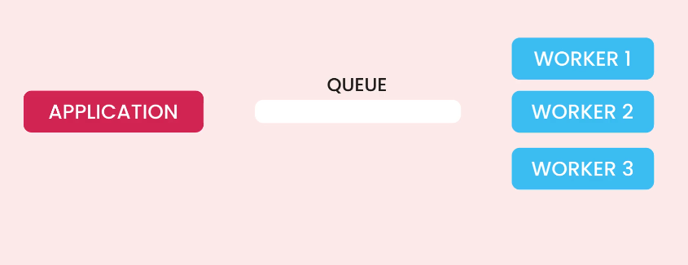

# Background tasks in Django — short theories

- Purpose: offload long-running, blocking, or periodic work from web requests to improve responsiveness and scalability.  
- Integrations: common patterns use Celery, RQ, Huey, Django Q, or custom management commands + cron/cron-like schedulers.  
- Broker/transport: Redis or RabbitMQ usually mediate task dispatch; choice affects latency, durability, and operational complexity.  
- Execution model: workers pull tasks from brokers; multiple workers offer parallelism and horizontal scaling.  
- Idempotency: tasks should be safe to retry; design for duplicate execution and partial failures.  
- Retries & backoff: robust systems implement retry policies, exponential backoff, and dead-letter handling.  
- Results & state: store outcomes in persistent stores (DB, cache, or results backend) when consumers need task results.  
- Transactions: enqueue tasks after DB commit or use transactional outboxes to avoid lost or duplicate tasks.  
- Scheduling: use periodic task schedulers (Celery beat, cron, django-crontab) for recurring jobs; prefer centralized scheduling in distributed systems.  
- Monitoring & observability: track task rates, failures, latencies, and worker health; alert on failure spikes.  
- Security & isolation: restrict task inputs, run in isolated environments, and avoid executing untrusted code.  
- Simpler alternatives: for lightweight needs, consider Django async views, background threads/processes for ephemeral jobs, or OS-level cron for infrequent tasks.

# NOTES FROM MOSH
## Introduction to CELERY
We have resource intensive tasks like:
- Processing images and videos
- Generating reports
- Sending emails
- Running machine learning models

We don't want to run this tasks inside a process that runs our application because if the process is busy it can't continue responding to client's requests.

- So we should keep the main process as free as possible, and anything that takes time we should offload it to another process, in order words we should run them in the background and when done, we can send notification to the user that their task is done and ready.

And this is where Celery comes into play. Celery (not the vegetable) is a tool from celeryproject.org which allows us to start workers to execute tasks in the background.

So with Celery, there are watchers on the background where we can distributes tasks to them through a queue and we can through this handle resource intensive or background or periodic tasks.

# MESSAGE BROKERS
In background tasks processing there is something called Message Broker (also known as message queue).
In english, Broker means => Middleman.

In the software world we have message brokers that are responsible for passing messages to applications in a reliable way.

So message brokers can assist to pass message from application A to Application B

APP A --> MESSAGE BROKER --> APP B

But then what if the message broker itself is unavailable? For this, we can setup a cluster of message brokers such that if one broker goes offline, we have other brokers that can route messages from A to B.

So in a nutshell we use message brokers to reliably deliver messages between pplications.

There are different kinds of Message brokers out there, but the two main brokers often used for django processes are:

## BROKER:
- Redis(in-memory data store -> can be used as a DB, cache and also a message broker)
- RabbitMQ (is a real, entrprise-grade broker, has so many features that Redis don't have, but then it comes with a cost).

In our lesson we'd use Redis as a message broker and as a cache.

# CELERY BEAT
Sometimes we want to schedule messages or tasks towards specific period of times instead of sending the tasks immediately, this is where Celery Beat comes into play

Celery Beat is a process that acts as a manager or work orchestrator

===

# AUTOMATED TESTING
Automated Testing is an essential practice in software engineering which helps to build efficient applications, however, while it is a great feat and skill, it can be like a two-edge sword that can get one frustrated when done wrongly.

# The Proper way to Automated Testing
- Test Behaviours not Implementation
Because implemenations may change so the test is to focus on how the API behaves not how it is implemented.

E.g An API to create a Collection
POST /collections
So we are meant to test the behaviour of the API
e.g Anonymous trying to access the endpoint to create a collection should return a 401 response
Non-Admin -> 403
Admin && invalid data -> 400
Admin && valid data -> 200

So this is how the collection API should behave when creating a collection.

So one more time **Test the behaviours not the implementation**

## TEST FRAMEWORKS FOR PYTHON APPLICATION
- Unittest
- Pytest

We would be using pytest because of:
- More features and less boilerplate

So we will install pytest as a development dependencies
pipenv install --dev pytest

- Also we install pytest plugins for django
pipenv install --dev pytest-django